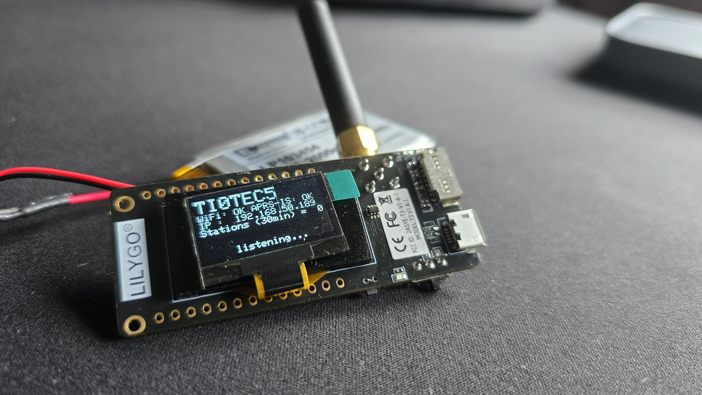
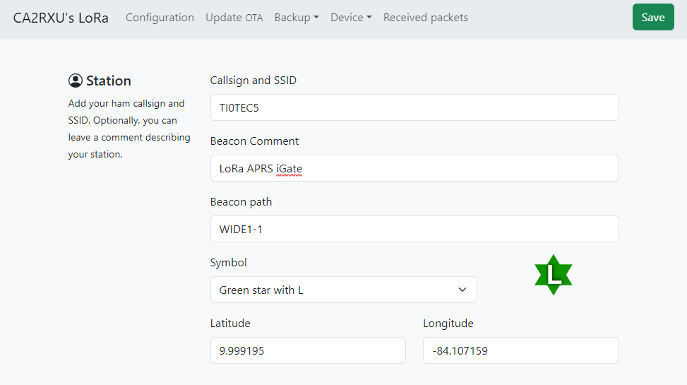

# Proyecto-1
Repositorio para el proyecto 1 del Curso Taller Integrador

## Descripcion General del proyecto
Para el proyecto se va a utilizar la placa LILYGO LoRa con un ESP32 Version T3 1.6.1 para poder configurar un iGate utilizado APRS y LoRa para las comunicaciones con otros Trackers. El iGate permite a los Trackers poder transmitir informacion de ubicacion y telemetria sin necesidad de utilizar protocolos comunmente utilizados como WIFI o LTE celular. Mediante LoRa se puede transmitir a grandes distancias utilizando radiofrecuencia para poder tener una comunicacion en zonas rurales o de poco acceso a otros medios o inclusive para poder monitorear flotillas de vehiculos en ruta. 

## Imagen del iGate configurado

## Imagen de la configuracion del dispositivo

Para la configuracion del dispositivo se requiere hacer una conexion a internet mediante WIFI para asi poder acceder al ip correspondiente del dispositivo y hacer los cambios necesarios. En la imagen anterior se muestra el Call Sign utlizado, junto con su comentario y su configuracion visual en el sitio de aprs.fi.

## Consideraciones para la Implementación

### Configuración del Hardware

- **Selección del Módulo LoRa:** Utiliza un módulo compatible como el LILYGO TTGO LoRa32, asegurando que opere en la frecuencia de 433.755 MHz.
- **Antena Adecuada:** La antena debe estar sintonizada a la frecuencia de operación para maximizar el alcance y la calidad de la señal.
- **Fuente de Alimentación:** La batería debe proporcionar suficiente energía para un funcionamiento continuo.

### Configuración del Software

- **Firmware y Bibliotecas:** Mantener el firmware actualizado y asegurarse de tener todas las bibliotecas necesarias instaladas.
- **Parámetros de Configuración:** Configurar correctamente la frecuencia de operación, las coordenadas GPS y el indicativo (Call Sign) del dispositivo.

### Integración con la Red APRS-IS

- **Conexión a Internet:** El dispositivo necesita una conexión Wi-Fi estable para transmitir datos a la red APRS-IS.
- **Verificación de Datos:** Utiliza plataformas como aprs.fi para verificar que los datos transmitidos se están registrando correctamente.

## Consideraciones sobre el Protocolo APRS

### Propósito del APRS

- **Seguimiento de Posición:** Permite el seguimiento en tiempo real de la posición de dispositivos móviles.
- **Telemetría y Mensajes:** Transmite datos de telemetría y mensajes, útil para la monitorización de vehículos y estaciones meteorológicas.

### Modulación y Formato de Datos

- **Modulación AFSK y LoRa:** APRS tradicionalmente usa AFSK para VHF/UHF, mientras que LoRa APRS usa modulación LoRa para mayor alcance y eficiencia.
- **Formato de Paquetes:** Los paquetes de datos deben cumplir con las especificaciones del protocolo APRS 1.01 para asegurar la interoperabilidad.
